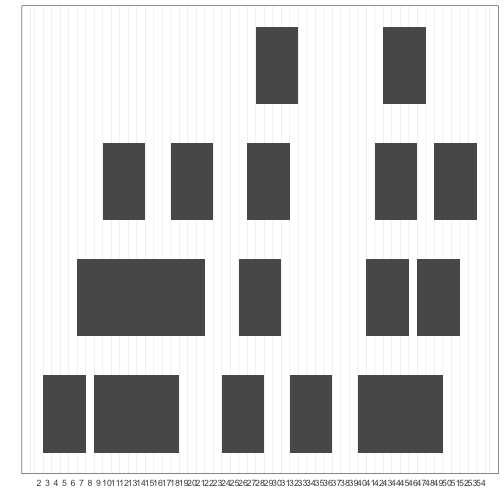
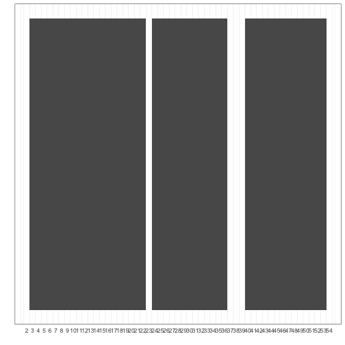
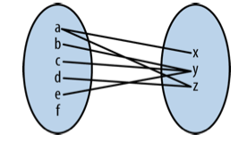
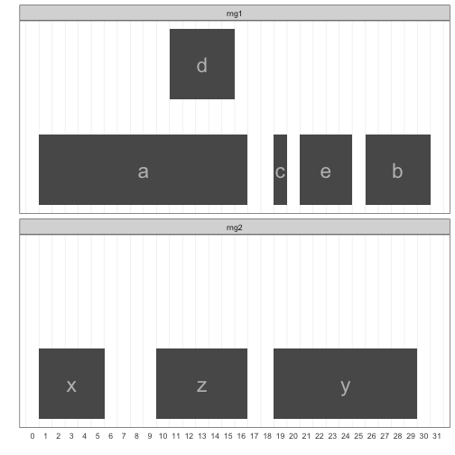
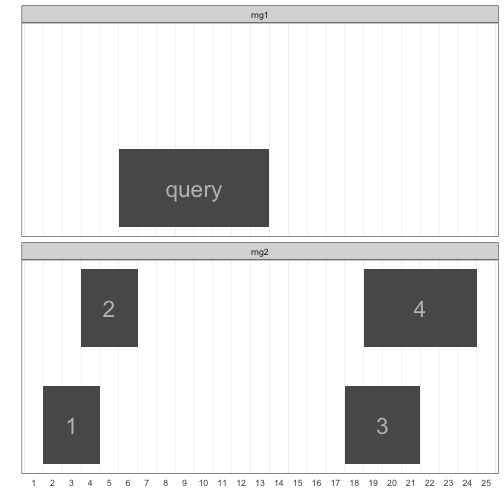

## Introduction (Chapter 9)

Many types of genomic data are linked to a specific genomic region, which can be 
represented as a range containing consecutive positions on a chromosome. Annotation data 
genomic features, and statistics like pairwise diversity and GC content 
can all be represented as ranges on a linear chromosome sequence. Sequencing read alignment 
data can also be represented as ranges.

Once our genomic data is represented as ranges on chromosomes, range 
operations can be used for finding and counting overlaps, calculating 
coverage, finding nearest ranges, and extracting nucleotide sequences from specific ranges. 
Specific problems like finding which SNPs overlap coding sequences, or counting the number 
of read alignments that overlap an exon have simple, general solutions once we represent our 
data as ranges and reshape our problem into one we can solve with range operations.

To specify a genomic region or position, we need three pieces of information:

* Chromosome name
> This is also known as sequence name (to allow for sequences that aren’t fully assembled, 
> such as scaffolds or contigs). Rather unfortunately, there is no standard naming 
> scheme for chromosome names across biology (and this will cause you headaches). Examples of 
> chromosome names include “chr17,” “22,” “chrX,” “Y,” and “MT”, or 
> scaffolds like “HE667775” or “scaffold_1648.” 

* Range
> For example, 114,414,997 to 114,693,772 or 3,173,498 to 3,179,449. Ranges are how we specify 
> a single subsequence on a chromosome sequence. Each range is composed of a start position and 
> an end position. As with chromosome names, there’s no standard way to represent a range in bioinformatics.

* Strand
> Because chromosomal DNA is double-stranded, features can reside on either the forward (positive) 
> or reverse (negative) strand.

These three components make up a genomic range (also know as a genomic interval). _Note_ that because 
reference genomes are our coordinate system for ranges, ranges are completely linked to a specic 
genome version, so when working with ranges we need to specify the version of genome they’re relative to.

The following figure depicts three ranges along a stretch of chromosome. Ranges x and y overlap each 
other (with a one base pair overlap), while range z is not overlapping any other range (and spans just 
a single base pair). Ranges x and z are both on the forward DNA strand , and their underlying 
nucleotide sequences are ACTT and C, respectively; range y is on the reverse strand, and its 
nucleotide sequence would be AGCCTTCGA.


> ## Reference Genome Versions
> Assembling and curating reference genomes is a continuous effort, and reference genomes are 
> perpetually changing and improving. Unfortunately, this also means that our coordinate system will 
> often change between genome versions, so a genomic region like chr15:27,754,876-27,755,076 will 
> not refer to the same genomic location across different genome versions. Thus genomic locations 
> are always relative to specific reference genomes versions. For reproducibility’s sake, it’s vital 
> to specify which version of reference genome you’re working with. 
>
> At some point, you’ll need to remap genomic range data from an older genome version’s coordinate 
> system to a newer version’s coordinate system. This would be a tedious undertaking, but luckily 
> there are established tools for the task:
> * CrossMap is a command-line tool that converts many data formats (BED, GFF/ GTF, SAM/BAM, Wiggle, 
> VCF) between coordinate systems of different assembly versions.
> * NCBI Genome Remapping Service is a web-based tool supporting a variety of genomes and formats.
> * LiftOver is also a web-based tool for converting between genomes hosted on the UCSC Genome Browser’s site.
>
{: .callout}

There are several important details we need to be aware of when working with the ranges. _First_, 
there are two different range systems used by bioinformatics data formats (see Table below) and software programs:
* 0-based coordinate system, with half-closed, half-open intervals.
* 1-based coordinate system, with closed intervals.
With 0-based coordinate systems, the first base of a sequence is position 0 and the last base’s position 
is the length of the sequence - 1. In this 0-based coordinate system, we use half-closed, half-open intervals. 

The second flavor is 1-based. In 1-based systems the first base of a sequence is given the position 1. 
Because positions are counted as we do natural numbers, the last position in a sequence is always equal 
to its length. With the 1-based systems we encounter in bioinformatics, ranges are represented as closed intervals. **Note**, there is an error in nucleotide numbering in Fig. 9-2 of the book.


The second gritty detail we need to worry about is strand. Because DNA is double stranded, genomic features can 
lie on either strand. Across nearly all range formats (BLAST results being the exception), 
a range’s coordinates are given on the forward strand of the reference sequence.

## An Interactive Introduction to Range Data with GenomicRanges

We’ll start with creating ranges and using range operations with the Bioconductor packages 
IRanges and GenomicRanges.

### Storing Generic Ranges with IRanges

Before working with genomic ranges, we’ll look at generic ranges 
(i.e., ranges that represent a contiguous subsequence of elements over any type of sequence) using 
the Bioconductor’s IRanges package. This package implements data structures for generic ranges and 
sequences, as well as the necessary functions to work with these types of data in R.

First, load the IRanges package:


~~~
library(IRanges)
~~~
{: .r}

The ranges we create with the IRanges package are called IRanges objects. Each IRanges object has the 
two basic components of any range: a start and end position. We can create ranges with the IRanges() function:


~~~
rng <- IRanges(start=4, end=13)
rng
~~~
{: .r}


~~~
IRanges object with 1 range and 0 metadata columns:
          start       end     width
      <integer> <integer> <integer>
  [1]         4        13        10
~~~
{: .output}

IRanges (and GenomicRanges) is 1-based, and uses closed intervals. 
The 1-based system was adopted to be consistent with R’s 1-based system

You can also create ranges by specifying their width, and either start or end position:


~~~
IRanges(start=4, width=3)
~~~
{: .r}


~~~
IRanges object with 1 range and 0 metadata columns:
          start       end     width
      <integer> <integer> <integer>
  [1]         4         6         3
~~~
{: .output}


~~~
IRanges(end=5, width=5)
~~~
{: .r}


~~~
IRanges object with 1 range and 0 metadata columns:
          start       end     width
      <integer> <integer> <integer>
  [1]         1         5         5
~~~
{: .output}

Also, the IRanges() constructor (a function that creates a new object) can take vector arguments, 
creating an IRanges object containing many ranges:


~~~
x <- IRanges(start=c(4, 7, 2, 20), end=c(13, 7, 5, 23))
x
~~~
{: .r}


~~~
IRanges object with 4 ranges and 0 metadata columns:
          start       end     width
      <integer> <integer> <integer>
  [1]         4        13        10
  [2]         7         7         1
  [3]         2         5         4
  [4]        20        23         4
~~~
{: .output}

Like many R objects, each range can be given a name. This can be accomplished by setting the names 
argument in IRanges, or using the function names():


~~~
names(x) <- letters[1:4]
x
~~~
{: .r}


~~~
IRanges object with 4 ranges and 0 metadata columns:
        start       end     width
    <integer> <integer> <integer>
  a         4        13        10
  b         7         7         1
  c         2         5         4
  d        20        23         4
~~~
{: .output}

These four ranges are depicted in the figure below, using the `plotIRanges()` function from Buffalo's 
book’s GitHub repository (requires ggplot). 


~~~
library("ggplot2")
source("../src/plot-ranges.R")
~~~
{: .r}

While on the outside x may look like a dataframe, it’s not—it’s a special object with class IRanges. 
We can see this with the function class():


~~~
class(x)
~~~
{: .r}


~~~
[1] "IRanges"
attr(,"package")
[1] "IRanges"
~~~
{: .output}


~~~
plotIRanges(x)
~~~
{: .r}


`str(x)` shows information contained by IRanges objects. We can use 
accessor functions to get parts of an IRanges object. For example, you can access 
the start positions, end positions, and widths of each range in this object with 
the methods `start()`, `end()`, and `width()`:


~~~
start(x)
~~~
{: .r}


~~~
[1]  4  7  2 20
~~~
{: .output}


~~~
end(x)
~~~
{: .r}


~~~
[1] 13  7  5 23
~~~
{: .output}


~~~
width(x)
~~~
{: .r}


~~~
[1] 10  1  4  4
~~~
{: .output}

These functions also work with <- to set start, end, and width position


~~~
end(x) <- end(x) + 4
x
~~~
{: .r}


~~~
IRanges object with 4 ranges and 0 metadata columns:
        start       end     width
    <integer> <integer> <integer>
  a         4        17        14
  b         7        11         5
  c         2         9         8
  d        20        27         8
~~~
{: .output}

The `range()` method returns the span of the ranges kept in an IRanges object:


~~~
range(x)
~~~
{: .r}


~~~
IRanges object with 1 range and 0 metadata columns:
          start       end     width
      <integer> <integer> <integer>
  [1]         2        27        26
~~~
{: .output}

We can subset IRanges just as we would any other R objects (vectors, dataframes, matrices), 
using either numeric, logical, or character (name) index:


~~~
x[2:3]
~~~
{: .r}


~~~
IRanges object with 2 ranges and 0 metadata columns:
        start       end     width
    <integer> <integer> <integer>
  b         7        11         5
  c         2         9         8
~~~
{: .output}


~~~
start(x) < 5
~~~
{: .r}


~~~
[1]  TRUE FALSE  TRUE FALSE
~~~
{: .output}


~~~
x[start(x) < 5]
~~~
{: .r}


~~~
IRanges object with 2 ranges and 0 metadata columns:
        start       end     width
    <integer> <integer> <integer>
  a         4        17        14
  c         2         9         8
~~~
{: .output}


~~~
x[width(x) > 8]
~~~
{: .r}


~~~
IRanges object with 1 range and 0 metadata columns:
        start       end     width
    <integer> <integer> <integer>
  a         4        17        14
~~~
{: .output}


~~~
x['a']
~~~
{: .r}


~~~
IRanges object with 1 range and 0 metadata columns:
        start       end     width
    <integer> <integer> <integer>
  a         4        17        14
~~~
{: .output}

Ranges can also be easily merged using the function c(), just as we used to combine vectors:


~~~
a <- IRanges(start=7, width=4)
b <- IRanges(start=2, end=5)
c(a, b)
~~~
{: .r}


~~~
IRanges object with 2 ranges and 0 metadata columns:
          start       end     width
      <integer> <integer> <integer>
  [1]         7        10         4
  [2]         2         5         4
~~~
{: .output}

With the basics of IRanges objects under our belt, we’re now ready to look at some basic range operations.

### Basic Range Operations: Arithmetic, Transformations, and Set Operations

So far, IRanges may look like nothing more than a dataframe that holds range data; in this section, 
we’ll see why these objects are so much more. The purpose of using a special class for storing ranges 
is that it allows for methods to perform specialized operations on this type of data. The methods 
included in the IRanges package to work with IRanges objects simplify and solve numerous genomics 
data analysis tasks. These same methods are implemented in the GenomicRanges package, and work 
similarly on GRanges objects as they do generic IRanges objects.

#### Growing and shrinking IRanges

IRanges objects can be grown or shrunk using arithmetic operations like +, -, and * (the division 
operator, /, doesn’t make sense on ranges, so it’s not supported). Growing ranges is useful for 
adding a buffer region. For example, we might want to include a few kilobases of sequence up and 
downstream of a coding region rather than just the coding region itself. With IRanges objects, 
addition (subtraction) will grow (shrink) a range symmetrically by the value added (subtracted) to it:


~~~
x <- IRanges(start=c(40, 80), end=c(67, 114)) 
x + 4L
~~~
{: .r}


~~~
IRanges object with 2 ranges and 0 metadata columns:
          start       end     width
      <integer> <integer> <integer>
  [1]        36        71        36
  [2]        76       118        43
~~~
{: .output}


~~~
x - 10L
~~~
{: .r}


~~~
IRanges object with 2 ranges and 0 metadata columns:
          start       end     width
      <integer> <integer> <integer>
  [1]        50        57         8
  [2]        90       104        15
~~~
{: .output}

Multiplication by a positive number “zooms in” to a range (making it narrower), while multiplication 
by a negative number “zooms out” (making it wider):


~~~
x
~~~
{: .r}


~~~
IRanges object with 2 ranges and 0 metadata columns:
          start       end     width
      <integer> <integer> <integer>
  [1]        40        67        28
  [2]        80       114        35
~~~
{: .output}


~~~
x * 2
~~~
{: .r}


~~~
IRanges object with 2 ranges and 0 metadata columns:
          start       end     width
      <integer> <integer> <integer>
  [1]        47        60        14
  [2]        89       105        17
~~~
{: .output}


~~~
x * -2
~~~
{: .r}


~~~
IRanges object with 2 ranges and 0 metadata columns:
          start       end     width
      <integer> <integer> <integer>
  [1]        26        81        56
  [2]        62       131        70
~~~
{: .output}

In practice, most transformations needed in genomics are more easily expressed by adding or subtracting constant amounts.

#### Restricting ranges and extracting flanking regions

Sometimes, rather than growing ranges by some amount, we want to restrict ranges within a certain bound. 
The IRanges package method `restrict()` cuts a set of ranges such that they fall inside of a certain bound


~~~
y <- IRanges(start=c(4, 6, 10, 12), width=13)
y
~~~
{: .r}


~~~
IRanges object with 4 ranges and 0 metadata columns:
          start       end     width
      <integer> <integer> <integer>
  [1]         4        16        13
  [2]         6        18        13
  [3]        10        22        13
  [4]        12        24        13
~~~
{: .output}


~~~
restrict(y, 5, 10)
~~~
{: .r}


~~~
IRanges object with 3 ranges and 0 metadata columns:
          start       end     width
      <integer> <integer> <integer>
  [1]         5        10         6
  [2]         6        10         5
  [3]        10        10         1
~~~
{: .output}

Another important transformation is `flank()`, which returns the regions that flank (are on the side of) 
each range in an IRanges object. `flank(`) is useful in creating ranges upstream and downstream of protein 
coding genes that could contain promoter sequences.


~~~
x
~~~
{: .r}


~~~
IRanges object with 2 ranges and 0 metadata columns:
          start       end     width
      <integer> <integer> <integer>
  [1]        40        67        28
  [2]        80       114        35
~~~
{: .output}


~~~
flank(x, width=7)
~~~
{: .r}


~~~
IRanges object with 2 ranges and 0 metadata columns:
          start       end     width
      <integer> <integer> <integer>
  [1]        33        39         7
  [2]        73        79         7
~~~
{: .output}

By default, flank() creates ranges width positions upstream of the ranges passed to it. Flanking ranges 
downstream can be created by setting `start=FALSE` (use `help(flank)` for more options):


~~~
x
~~~
{: .r}


~~~
IRanges object with 2 ranges and 0 metadata columns:
          start       end     width
      <integer> <integer> <integer>
  [1]        40        67        28
  [2]        80       114        35
~~~
{: .output}


~~~
flank(x, width=7, start=FALSE)
~~~
{: .r}


~~~
IRanges object with 2 ranges and 0 metadata columns:
          start       end     width
      <integer> <integer> <integer>
  [1]        68        74         7
  [2]       115       121         7
~~~
{: .output}

#### Merging overlapping ranges and finding gaps

Another common operation is `reduce()`. It takes a set of possibly overlapping ranges and reduces 
them to a set of nonoverlapping ranges that cover the same positions. Any overlapping ranges are 
merged into a single range in the result:


~~~
set.seed(0) # set the random number generator seed
alns <- IRanges(start=sample(seq_len(50), 20), width=5)
head(alns, 4)
~~~
{: .r}


~~~
IRanges object with 4 ranges and 0 metadata columns:
          start       end     width
      <integer> <integer> <integer>
  [1]        45        49         5
  [2]        14        18         5
  [3]        18        22         5
  [4]        27        31         5
~~~
{: .output}


~~~
reduced_alns <- reduce(alns)
plotIRanges(alns)
~~~
{: .r}



~~~
plotIRanges(reduced_alns)
~~~
{: .r}



A similar operation to `reduce()` is `gaps()`, which returns the gaps (uncovered portions) between 
ranges. `gaps()` has numerous applications in genomics: creating intron ranges between exons ranges, 
finding gaps in coverage, defining intragenic regions between genic regions, and more.


~~~
gaps(alns)
~~~
{: .r}


~~~
IRanges object with 2 ranges and 0 metadata columns:
          start       end     width
      <integer> <integer> <integer>
  [1]        23        23         1
  [2]        37        39         3
~~~
{: .output}

By default, gaps() only returns the gaps between ranges. If you’d like `gaps()` to include gaps at the 
beginning and the end of the sequence, specify the start and end positions in gaps 
(e.g., `gaps(alns, start=1, end=60)`).

#### Set operations

Another class of useful range operations are analogous to set operations. Each range can be thought of 
as a set of consecutive integers, so an IRange object like `IRange(start=4, end=7)` is simply the integers 
4, 5, 6, and 7. Hence, one can think about range operations as set operations like difference (`setdiff()`), 
intersection (`intersect()`), union (`union()`), and complement (which is simply the function `gaps()` we 
saw earlier):


~~~
a <- IRanges(start=4, end=13)
b <- IRanges(start=12, end=17)
intersect(a, b)
~~~
{: .r}


~~~
IRanges object with 1 range and 0 metadata columns:
          start       end     width
      <integer> <integer> <integer>
  [1]        12        13         2
~~~
{: .output}


~~~
setdiff(a, b)
~~~
{: .r}


~~~
IRanges object with 1 range and 0 metadata columns:
          start       end     width
      <integer> <integer> <integer>
  [1]         4        11         8
~~~
{: .output}


~~~
setdiff(b, a)
~~~
{: .r}


~~~
IRanges object with 1 range and 0 metadata columns:
          start       end     width
      <integer> <integer> <integer>
  [1]        14        17         4
~~~
{: .output}


~~~
union(a,b)
~~~
{: .r}


~~~
IRanges object with 1 range and 0 metadata columns:
          start       end     width
      <integer> <integer> <integer>
  [1]         4        17        14
~~~
{: .output}


Sets operations operate on IRanges with multiple ranges (rows) as if they’ve been collapsed with reduce() 
first (because mathematically, overlapping ranges make up the same set). IRanges also has a group of set 
operation functions that act pairwise, taking two equal-length IRanges objects and working range-wise: 
`psetdiff()`, `pintersect()`, `punion()`, and `pgap()`.

### Finding Overlapping Ranges

#### Using `findOverlaps()` function

Finding overlaps is an essential part of many genomics analysis tasks. 
We’ll start with the basic task of finding overlaps between two sets of IRanges objects using the 
`findOverlaps()` function. `findOverlaps()` takes query and subject IRanges objects as its first 
two arguments:


~~~
qry <- IRanges(start=c(1, 26, 19, 11, 21, 7), end=c(16, 30, 19, 15, 24, 8), names=letters[1:6])
sbj <- IRanges(start=c(1, 19, 10), end=c(5, 29, 16), names=letters[24:26])
qry
~~~
{: .r}


~~~
IRanges object with 6 ranges and 0 metadata columns:
        start       end     width
    <integer> <integer> <integer>
  a         1        16        16
  b        26        30         5
  c        19        19         1
  d        11        15         5
  e        21        24         4
  f         7         8         2
~~~
{: .output}


~~~
sbj
~~~
{: .r}


~~~
IRanges object with 3 ranges and 0 metadata columns:
        start       end     width
    <integer> <integer> <integer>
  x         1         5         5
  y        19        29        11
  z        10        16         7
~~~
{: .output}


~~~
hts <- findOverlaps(qry, sbj)
hts
~~~
{: .r}


~~~
Hits object with 6 hits and 0 metadata columns:
      queryHits subjectHits
      <integer>   <integer>
  [1]         1           1
  [2]         1           3
  [3]         2           2
  [4]         3           2
  [5]         4           3
  [6]         5           2
  -------
  queryLength: 6 / subjectLength: 3
~~~
{: .output}

Thinking abstractly, overlaps represent a mapping between query and subject. Depending on how we find 
overlaps, each query can have many hits in different subjects. A single subject range will always be 
allowed to have many query hits.



The Hits object from `findOverlaps()` has two columns on indices: one for the query ranges and one for the 
subject ranges. Each row contains the index of a query range that overlaps a subject range, and the index 
of the subject range it overlaps. We can access these indices by using the accessor functions `queryHits()` 
and `subjectHits()`. For example, if we wanted to find the names of each query and subject range with an 
overlap, we could do:


~~~
names(qry)[queryHits(hts)]
~~~
{: .r}


~~~
[1] "a" "a" "b" "c" "d" "e"
~~~
{: .output}


~~~
names(sbj)[subjectHits(hts)]
~~~
{: .r}


~~~
[1] "x" "z" "y" "y" "z" "y"
~~~
{: .output}


~~~
#Notice:
queryHits(hts)
~~~
{: .r}


~~~
[1] 1 1 2 3 4 5
~~~
{: .output}


~~~
plotIRanges(rng1=qry[unique(queryHits(hts))],rng2=sbj[unique(subjectHits(hts))])
~~~
{: .r}



The plot above shows which of the ranges in qry overlap the ranges in sbj. From this graphic, it’s 
easy to see how `findOverlaps()` is computing overlaps: a range is considered to be overlapping if 
any part of it overlaps a subject range. This type of overlap behavior is set with the type argument 
to `findOverlaps()`, which is "any" by default. Depending on our biological task, type="any" may not 
be the best form of overlap. For example, we could limit our overlap results to only include query 
ranges that fall entirely within subject ranges with `type=within`:


~~~
hts_within <- findOverlaps(qry, sbj, type="within")
plotIRanges(rng1=qry[unique(queryHits(hts_within))],rng2=sbj[unique(subjectHits(hts_within))])
~~~
{: .r}


Another `findOverlaps()` parameter that we need to consider when computing overlaps is `select`, 
which determines how `findOverlaps()` handles cases where a single query range overlaps more than 
one subject range. By default, select="all", meaning that all overlapping ranges are returned. Additional 
options include "first", "last", and "arbitrary". Because these options all lead `findOverlaps()` to 
return only one overlapping subject range per query (or NA if no overlap is found), results are returned 
in an integer vector where each element corresponds to a query range in qry:


~~~
findOverlaps(qry, sbj, select="first")
~~~
{: .r}


~~~
[1]  1  2  2  3  2 NA
~~~
{: .output}


~~~
findOverlaps(qry, sbj, select="last")
~~~
{: .r}


~~~
[1]  3  2  2  3  2 NA
~~~
{: .output}


~~~
findOverlaps(qry, sbj, select="arbitrary")
~~~
{: .r}


~~~
[1]  1  2  2  3  2 NA
~~~
{: .output}
  
> ## Mind Your Overlaps
>
> What an overlap “is” may seem obvious at first, but the specifics can matter a lot in real-life 
> genomic applications. For example, allowing for a query range to overlap any part of a subject 
> range makes sense when we’re looking for SNPs in exons. However, classifying a 1kb genomic window 
> as coding because it overlaps a single base of a gene may make less sense. It’s important to 
> always relate your quantification methods to the underlying biology of what you’re trying to understand.
> The intricacies of overlap operations are especially important when we use overlaps to quantify 
> something, such as expression in an RNA-seq study.
>
> The take-home lessons are as follows:
> * Mind what your code is considering an overlap.
> * For quantification tasks, simple overlap counting is best thought of as an approximation 
> (and more sophisticated meth‐ ods do exist).
> 
{: .callout}

> ## Interval trees
> 
> The function `IntervalTree()` is defunct starting with BioC 3.2.
> `findOverlaps`/`countOverlaps` functions are now implemented based on Nested Containment Lists.
{: .callout}

After running `findOverlaps()`, we need to work with Hits objects to extract information from the 
overlapping ranges. Hits objects support numerous helpful methods in addition to the `queryHits()` 
and `subjectHits()` accessor functions (see help(queryHits) for more information):


~~~
countQueryHits(hts) #countQueryHits() returns a vector with the # of subject ranges overlapping each query range.
~~~
{: .r}


~~~
[1] 2 1 1 1 1 0
~~~
{: .output}


~~~
setNames(countQueryHits(hts), names(qry)) 
~~~
{: .r}


~~~
a b c d e f 
2 1 1 1 1 0 
~~~
{: .output}


~~~
countSubjectHits(hts) #countQueryHits(), but returns how many query ranges overlap the subject ranges.
~~~
{: .r}


~~~
[1] 1 3 2
~~~
{: .output}


~~~
setNames(countSubjectHits(hts), names(sbj))
~~~
{: .r}


~~~
x y z 
1 3 2 
~~~
{: .output}


~~~
ranges(hts, qry, sbj) #create a set of ranges for overlapping regions
~~~
{: .r}


~~~
IRanges object with 6 ranges and 0 metadata columns:
          start       end     width
      <integer> <integer> <integer>
  [1]         1         5         5
  [2]        10        16         7
  [3]        26        29         4
  [4]        19        19         1
  [5]        11        15         5
  [6]        21        24         4
~~~
{: .output}


~~~
#plotIRanges(rng1=qry, rng2=sbj, rng3=ranges(hts, qry, sbj))
~~~
{: .r}

Hits objects can be coerced to matrix using `as.matrix()`:


~~~
as.matrix(hts)
~~~
{: .r}


~~~
     queryHits subjectHits
[1,]         1           1
[2,]         1           3
[3,]         2           2
[4,]         3           2
[5,]         4           3
[6,]         5           2
~~~
{: .output}

A nice feature of working with ranges in R is that we can leverage R’s full array of data analysis 
capabilities to explore these ranges. For example, after using `ranges(hts, qry, sbj`) to create a range 
corresponding to the region shared between each over‐ lapping query and subject range, you could use `summary(width(ranges(hts, qry, sbj)))` to get a summary of how large the overlaps are, or use ggplot2 
to plot a histo‐ gram of all overlapping widths:


~~~
summary(width(ranges(hts, qry, sbj)))
~~~
{: .r}


~~~
   Min. 1st Qu.  Median    Mean 3rd Qu.    Max. 
  1.000   4.000   4.500   4.333   5.000   7.000 
~~~
{: .output}

The functions `subsetByOverlaps()` and `countOverlaps()` simplify some of the most common operations 
performed on ranges once overlaps are found: keeping only the subset of queries that overlap subjects, 
and counting overlaps:


~~~
countOverlaps #similar to the solution using countQueryOverlaps() and set Names().
~~~
{: .r}


~~~
standardGeneric for "countOverlaps" defined from package "IRanges"

function (query, subject, maxgap = 0L, minoverlap = 1L, type = c("any", 
    "start", "end", "within", "equal"), ...) 
standardGeneric("countOverlaps")
<environment: 0x7f7fc0fbeb18>
Methods may be defined for arguments: query, subject
Use  showMethods("countOverlaps")  for currently available ones.
~~~
{: .output}


~~~
subsetByOverlaps(qry, sbj) #returns the same as qry[unique(queryHits(hts))]
~~~
{: .r}


~~~
IRanges object with 5 ranges and 0 metadata columns:
        start       end     width
    <integer> <integer> <integer>
  a         1        16        16
  b        26        30         5
  c        19        19         1
  d        11        15         5
  e        21        24         4
~~~
{: .output}

## Finding Nearest Ranges and Calculating Distance

In the IRanges package, there are three functions for finding ranges that neighbor query ranges: 
`nearest()`, `precede()`, and `follow()`. Each of these functions take the query and subject ranges 
as their first and second arguments, and return an index to which subject matches. Note, that these 
functions are with respect to the query: `precede()` finds ranges that the query precedes and `follow()` 
finds ranges that the query follows.


~~~
qry <- IRanges(start=6, end=13, name='query')
sbj <- IRanges(start=c(2, 4, 18, 19), end=c(4, 6, 21, 24), names=1:4)
plotIRanges(rng1=qry, rng2=sbj)
~~~
{: .r}



~~~
nearest(qry, sbj)
~~~
{: .r}


~~~
[1] 2
~~~
{: .output}


~~~
precede(qry, sbj)
~~~
{: .r}


~~~
[1] 3
~~~
{: .output}


~~~
follow(qry, sbj)
~~~
{: .r}


~~~
[1] 1
~~~
{: .output}

Note that the function `nearest()` behaves slightly differently than `precede()` and `follow()` 
as it will return the nearest range even if it overlaps the query range. 

Note too that these operations are all vectorized, so you can provide a query IRanges object with multiple ranges:


~~~
qry2 <- IRanges(start=c(6, 7), width=3)
nearest(qry2, sbj)
~~~
{: .r}


~~~
[1] 2 2
~~~
{: .output}

This family of functions for finding nearest ranges also includes `distanceToNearest()` and `distance()`, 
which return the distance to the nearest range and the pairwise distances between ranges. 
We’ll create some random ranges to use in this example:


~~~
qry <- IRanges(sample(seq_len(1000), 5), width=10)
sbj <- IRanges(sample(seq_len(1000), 5), width=10)
qry; sbj
~~~
{: .r}


~~~
IRanges object with 5 ranges and 0 metadata columns:
          start       end     width
      <integer> <integer> <integer>
  [1]       778       787        10
  [2]       934       943        10
  [3]       212       221        10
  [4]       650       659        10
  [5]       126       135        10
~~~
{: .output}


~~~
IRanges object with 5 ranges and 0 metadata columns:
          start       end     width
      <integer> <integer> <integer>
  [1]       268       277        10
  [2]       386       395        10
  [3]        14        23        10
  [4]       382       391        10
  [5]       867       876        10
~~~
{: .output}


~~~
distanceToNearest(qry, sbj)
~~~
{: .r}


~~~
Hits object with 5 hits and 1 metadata column:
      queryHits subjectHits |  distance
      <integer>   <integer> | <integer>
  [1]         1           5 |        79
  [2]         2           5 |        57
  [3]         3           1 |        46
  [4]         4           5 |       207
  [5]         5           3 |       102
  -------
  queryLength: 5 / subjectLength: 5
~~~
{: .output}


~~~
distance(qry, sbj) #returns vector of average(?) pairwise distances between query and all subject ranges:
~~~
{: .r}


~~~
[1] 500 538 188 258 731
~~~
{: .output}


> ## Challenge 3
>
> 1. Create a directory within your project called `graphs`.
> 2. Modify the `.gitignore` file to contain `graphs/`
> so that this disposable output isn't versioned.
>
> Add the newly created folders to version control using
> the git interface.
>
> > ## Solution to Challenge 3
> >
> > This can be done with the command line:
> > ```
> > $ mkdir graphs
> > $ echo "graphs/" >> .gitignore
> > ```
> > {: . shell}
> {: .solution}
{: .challenge}
