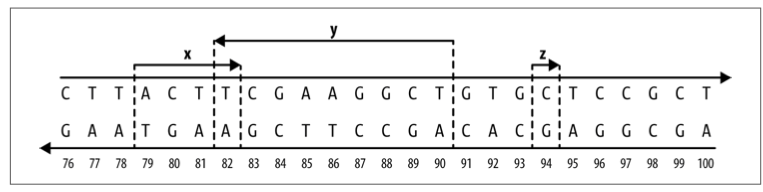
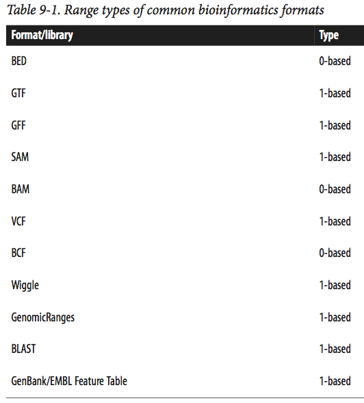
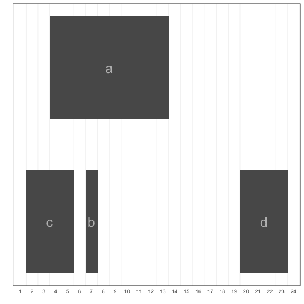

## Introduction (Chapter 9)

Many types of genomic data are linked to a specific genomic region, which can be 
represented as a range containing consecutive positions on a chromosome. Annotation data 
genomic features, and statistics like pairwise diversity and GC content 
can all be represented as ranges on a linear chromosome sequence. Sequencing read alignment 
data can also be represented as ranges.

Once our genomic data is represented as ranges on chromosomes, range 
operations can be used for finding and counting overlaps, calculating 
coverage, finding nearest ranges, and extracting nucleotide sequences from specific ranges. 
Specific problems like finding which SNPs overlap coding sequences, or counting the number 
of read alignments that overlap an exon have simple, general solutions once we represent our 
data as ranges and reshape our problem into one we can solve with range operations.

To specify a genomic region or position, we need three pieces of information:

* Chromosome name
> This is also known as sequence name (to allow for sequences that aren’t fully assembled, 
> such as scaffolds or contigs). Rather unfortunately, there is no standard naming 
> scheme for chromosome names across biology (and this will cause you headaches). Examples of 
> chromosome names include “chr17,” “22,” “chrX,” “Y,” and “MT”, or 
> scaffolds like “HE667775” or “scaffold_1648.” 

* Range
> For example, 114,414,997 to 114,693,772 or 3,173,498 to 3,179,449. Ranges are how we specify 
> a single subsequence on a chromosome sequence. Each range is composed of a start position and 
> an end position. As with chromosome names, there’s no standard way to represent a range in bioinformatics.

* Strand
> Because chromosomal DNA is double-stranded, features can reside on either the forward (positive) 
> or reverse (negative) strand.

These three components make up a genomic range (also know as a genomic interval). Note that because 
reference genomes are our coordinate system for ranges, ranges are completely linked to a specic 
genome version. In other words, genomic locations are relative to reference genomes, so when working 
with and speaking about ranges we need to specify the version of genome they’re relative to.

The following figure depicts three ranges along a stretch of chromosome. Ranges x and y overlap each 
other (with a one base pair overlap), while range z is not overlapping any other range (and spans just 
a single base pair). Ranges x and z are both on the forward DNA strand , and their underlying 
nucleotide sequences are ACTT and C, respectively; range y is on the reverse strand, and its 
nucleotide sequence would be AGCCTTCGA.



>  ## Reference Genome Versions
> Assembling and curating reference genomes is a continuous effort, and reference genomes are 
> perpetually changing and improving. Unfortunately, this also means that our coordinate system will 
> often change between genome versions, so a genomic region like chr15:27,754,876-27,755,076 will 
> not refer to the same genomic location across different genome versions. Thus genomic locations 
> are always relative to specific reference genomes versions. For reproducibility’s sake, it’s vital 
> to specify which version of reference genome you’re working with. 
>
> At some point, you’ll need to remap genomic range data from an older genome version’s coordinate 
> system to a newer version’s coordinate system. This would be a tedious undertaking, but luckily 
> there are established tools for the task:
> * CrossMap is a command-line tool that converts many data formats (BED, GFF/ GTF, SAM/BAM, Wiggle, 
> VCF) between coordinate systems of different assembly versions.
> * NCBI Genome Remapping Service is a web-based tool supporting a variety of genomes and formats.
> * LiftOver is also a web-based tool for converting between genomes hosted on the UCSC Genome Browser’s site.
>
{: .callout}

Despite the convenience that comes with representing and working with genomic ranges, there are 
unfortunately some gritty details we need to be aware of. First, there are two different flavors of 
range systems used by bioinformatics data formats (see Table 9-1 for a reference) and software programs:
* 0-based coordinate system, with half-closed, half-open intervals.
* 1-based coordinate system, with closed intervals.
With 0-based coordinate systems, the first base of a sequence is position 0 and the last base’s position 
is the length of the sequence - 1. In this 0-based coordinate system, we use half-closed, half-open intervals. 

The second flavor is 1-based. As you might have guessed, with 1-based systems the first base of a sequence is given the position 1. Because positions are counted as we do natural numbers, the last position in a sequence is always equal to its length. With the 1-based systems we encounter in bioinformatics, ranges are represented as closed intervals. **Note**, there is an error in nucleotide numbering in Fig. 9-2 of the book.



The second gritty detail we need to worry about is strand. There’s little to say except: 
you need to mind strand in your work. Because DNA is double stranded, genomic features can 
lie on either strand. Across nearly all range formats (BLAST results being the exception), 
a range’s coordinates are given on the forward strand of the reference sequence.

## An Interactive Introduction to Range Data with GenomicRanges

To get a feeling for representing and working with data as ranges on a chromosome, we’ll 
step through creating ranges and using range operations with the Bioconductor packages 
IRanges and GenomicRanges.

### Storing Generic Ranges with IRanges

Before diving into working with genomic ranges, we’re going to get our feet wet with generic ranges 
(i.e., ranges that represent a contiguous subsequence of elements over any type of sequence) using 
the Bioconductor’s IRanges package. This package implements data structures for generic ranges and 
sequences, as well as the necessary functions to work with these types of data in R.

Let’s get started by creating some ranges using IRanges. First, load the IRanges package:


~~~
library(IRanges)
~~~
{: .r}

The ranges we create with the IRanges package are called IRanges objects. Each IRanges object has the 
two basic components of any range: a start and end position. We can create ranges with the IRanges() function:


~~~
rng <- IRanges(start=4, end=13)
rng
~~~
{: .r}


~~~
IRanges object with 1 range and 0 metadata columns:
          start       end     width
      <integer> <integer> <integer>
  [1]         4        13        10
~~~
{: .output}

The most important fact to note: IRanges (and GenomicRanges) is 1-based, and uses closed intervals. 
The 1-based system was adopted to be consistent with R’s 1-based system

You can also create ranges by specifying their width, and either start or end position:


~~~
IRanges(start=4, width=3)
~~~
{: .r}


~~~
IRanges object with 1 range and 0 metadata columns:
          start       end     width
      <integer> <integer> <integer>
  [1]         4         6         3
~~~
{: .output}


~~~
IRanges(end=5, width=5)
~~~
{: .r}


~~~
IRanges object with 1 range and 0 metadata columns:
          start       end     width
      <integer> <integer> <integer>
  [1]         1         5         5
~~~
{: .output}

Also, the IRanges() constructor (a function that creates a new object) can take vector arguments, 
creating an IRanges object containing many ranges:


~~~
x <- IRanges(start=c(4, 7, 2, 20), end=c(13, 7, 5, 23))
x
~~~
{: .r}


~~~
IRanges object with 4 ranges and 0 metadata columns:
          start       end     width
      <integer> <integer> <integer>
  [1]         4        13        10
  [2]         7         7         1
  [3]         2         5         4
  [4]        20        23         4
~~~
{: .output}

Like many R objects, each range can be given a name. This can be accomplished by setting the names 
argument in IRanges, or using the function names():


~~~
names(x) <- letters[1:4]
x
~~~
{: .r}


~~~
IRanges object with 4 ranges and 0 metadata columns:
        start       end     width
    <integer> <integer> <integer>
  a         4        13        10
  b         7         7         1
  c         2         5         4
  d        20        23         4
~~~
{: .output}

These four ranges are depicted in the figure below, using the `plotIRanges()` function from Buffalo's 
book’s GitHub repository (requires ggplot). 


~~~
library("ggplot2")
source("../src/plot-ranges.R")
~~~
{: .r}

While on the outside x may look like a dataframe, it’s not—it’s a special object with class IRanges. 
Much of Bioconductor is built from objects and classes. Using the function class(), we can see it’s an IRanges object:


~~~
class(x)
~~~
{: .r}


~~~
[1] "IRanges"
attr(,"package")
[1] "IRanges"
~~~
{: .output}


~~~
plotIRanges(x)
~~~
{: .r}



IRanges objects contain all information about the ranges you’ve created internally. 
If you’re curious what’s under the hood, call `str(x)` to take a peek. We can use 
accessor functions to get parts of an IRanges object. For example, you can access 
the start positions, end positions, and widths of each range in this object with 
the methods `start()`, `end()`, and `width()`:


~~~
start(x)
~~~
{: .r}


~~~
[1]  4  7  2 20
~~~
{: .output}


~~~
end(x)
~~~
{: .r}


~~~
[1] 13  7  5 23
~~~
{: .output}


~~~
width(x)
~~~
{: .r}


~~~
[1] 10  1  4  4
~~~
{: .output}

These functions also work with <- to set start, end, and width position


~~~
end(x) <- end(x) + 4
x
~~~
{: .r}


~~~
IRanges object with 4 ranges and 0 metadata columns:
        start       end     width
    <integer> <integer> <integer>
  a         4        17        14
  b         7        11         5
  c         2         9         8
  d        20        27         8
~~~
{: .output}

The `range()` method returns the span of the ranges kept in an IRanges object:


~~~
range(x)
~~~
{: .r}


~~~
IRanges object with 1 range and 0 metadata columns:
          start       end     width
      <integer> <integer> <integer>
  [1]         2        27        26
~~~
{: .output}

We can subset IRanges just as we would any other R objects (vectors, dataframes, matrices), 
using either numeric, logical, or character (name) index:


~~~
x[2:3]
~~~
{: .r}


~~~
IRanges object with 2 ranges and 0 metadata columns:
        start       end     width
    <integer> <integer> <integer>
  b         7        11         5
  c         2         9         8
~~~
{: .output}


~~~
start(x) < 5
~~~
{: .r}


~~~
[1]  TRUE FALSE  TRUE FALSE
~~~
{: .output}


~~~
x[start(x) < 5]
~~~
{: .r}


~~~
IRanges object with 2 ranges and 0 metadata columns:
        start       end     width
    <integer> <integer> <integer>
  a         4        17        14
  c         2         9         8
~~~
{: .output}


~~~
x[width(x) > 8]
~~~
{: .r}


~~~
IRanges object with 1 range and 0 metadata columns:
        start       end     width
    <integer> <integer> <integer>
  a         4        17        14
~~~
{: .output}


~~~
x['a']
~~~
{: .r}


~~~
IRanges object with 1 range and 0 metadata columns:
        start       end     width
    <integer> <integer> <integer>
  a         4        17        14
~~~
{: .output}

Ranges can also be easily merged using the function c(), just as we used to combine vectors:


~~~
a <- IRanges(start=7, width=4)
b <- IRanges(start=2, end=5)
c(a, b)
~~~
{: .r}


~~~
IRanges object with 2 ranges and 0 metadata columns:
          start       end     width
      <integer> <integer> <integer>
  [1]         7        10         4
  [2]         2         5         4
~~~
{: .output}

With the basics of IRanges objects under our belt, we’re now ready to look at some basic range operations.

### Basic Range Operations: Arithmetic, Transformations, and Set Operations

> ## Tip: versioning disposable output
>
> Generally you do not want to version disposable output (or read-only data).
> You should modify the `.gitignore` file to tell git to ignore these files
> and directories.
{: .callout}

> ## Challenge 3
>
> 1. Create a directory within your project called `graphs`.
> 2. Modify the `.gitignore` file to contain `graphs/`
> so that this disposable output isn't versioned.
>
> Add the newly created folders to version control using
> the git interface.
>
> > ## Solution to Challenge 3
> >
> > This can be done with the command line:
> > ```
> > $ mkdir graphs
> > $ echo "graphs/" >> .gitignore
> > ```
> > {: . shell}
> {: .solution}
{: .challenge}
