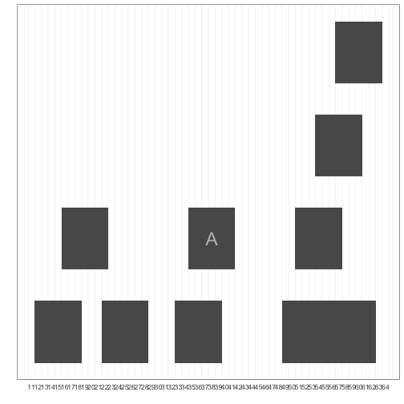

## Run Length Encoding and Views

The generic ranges implemented by IRanges can be ranges over any type of sequence. In the context 
of genomic data, these ranges’ coordinates are based on the underlying nucleic acid sequence of a 
particular chromosome. Yet, many other types of genomic data form a sequence of numeric values 
over each position of a chromosome sequence. Some examples include

* Coverage, the depth of overlap of ranges across the length of a sequence, used 
  extensively in genomics.
* Conservation tracks, which are base-by-base evolutionary conservation scores between species, 
  generated by a program like phastCons (see Siepel et al., 2005 as an example).
* Per-base pair estimates of population genomics summary statistics like nucleotide diversity.

In this section, we’ll take a closer look at working with coverage data, creating ranges from 
numeric sequence data, and a powerful abstraction called views.

### Run-length encoding and coverage()

Long sequences can grow quite large in memory. For example, a track containing numeric values 
over each of the 248,956,422 bases of chromosome 1 of the human genome version GRCh38 would be 
1.9Gb in memory. To accommodate working with data this size in R, IRanges can work with sequences 
compressed using a clever trick: it compresses runs of the same value. For example, imagine a 
sequence of integers that represent the coverage of a region in a chromosome:

> 4 4 4 3 3 2 1 1 1 1 1 0 0 0 0 0 0 0 1 1 1 4 4 4 4 4 4 4

Data like coverage often exhibit runs: consecutive stretches of the same value. We can compress these 
runs using a scheme called run-length encoding:

~~~
x<-as.integer(c(4, 4, 4, 3, 3, 2, 1, 1, 1, 1, 1, 0, 0, 0, 0, 0, 0, 0, 1, 1, 1, 4, 4, 4, 4, 4, 4, 4))
xrle <- Rle(x)
xrle
~~~
{: .r}

~~~
integer-Rle of length 28 with 7 runs
  Lengths: 3 2 1 5 7 3 7
  Values : 4 3 2 1 0 1 4
~~~
{: .output}

The function `Rle()` takes a vector and returns a run-length encoded version. `Rle()` is a function 
from a low-level Bioconductor package called "S4Vectors", which is automatically loaded with IRanges. 
We can revert back to vector form with as.vector():

~~~
as.vector(xrle)
~~~
{: .r}

~~~
 [1] 4 4 4 3 3 2 1 1 1 1 1 0 0 0 0 0 0 0 1 1 1 4 4 4 4 4 4 4
~~~
{: .output}

Run-length encoded objects support most of the basic operations that regular R vec‐ tors do, including subsetting, arithemetic and comparison operations, summary functions, and math functions:

~~~
xrle + 4L
~~~
{: .r}

~~~
integer-Rle of length 28 with 7 runs
  Lengths: 3 2 1 5 7 3 7
  Values : 8 7 6 5 4 5 8
~~~
{: .output}

~~~
xrle / 2
~~~
{: .r}

~~~
numeric-Rle of length 28 with 7 runs
  Lengths:   3   2   1   5   7   3   7
  Values :   2 1.5   1 0.5   0 0.5   2
~~~
{: .output}

~~~
xrle > 3
~~~
{: .r}

~~~
logical-Rle of length 28 with 3 runs
  Lengths:     3    18     7
  Values :  TRUE FALSE  TRUE
~~~
{: .output}

~~~
xrle[xrle > 3]
~~~
{: .r}

~~~
integer-Rle of length 10 with 1 run
  Lengths: 10
  Values :  4
~~~
{: .output}

~~~
sum(xrle)
~~~
{: .r}

~~~
[1] 56
~~~
{: .output}

~~~
summary(xrle)
~~~
{: .r}

~~~
   Min. 1st Qu.  Median    Mean 3rd Qu.    Max. 
   0.00    0.75    1.00    2.00    4.00    4.00 
~~~
{: .output}

~~~
round(cos(xrle), 2)
~~~
{: .r}

~~~
numeric-Rle of length 28 with 7 runs
  Lengths:     3     2     1     5     7     3     7
  Values : -0.65 -0.99 -0.42  0.54     1  0.54 -0.65
~~~
{: .output}

We can also access an Rle object’s lengths and values using the functions run Lengths() and runValues():

~~~
runLength(xrle)
~~~
{: .r}

~~~
[1] 3 2 1 5 7 3 7
~~~
{: .output}

~~~
runValue(xrle)
~~~
{: .r}

~~~
[1] 4 3 2 1 0 1 4
~~~
{: .output}

One place where we encounter run-length encoded values is in working with `coverage()`. The `coverage()` 
function takes a set of ranges and returns their coverage as an Rle object (to the end of the rightmost range). 
Simulating 70 random ranges over a sequence of 100 positions:

~~~
set.seed(0)
rngs <- IRanges(start=sample(seq_len(60), 10), width=7)
names(rngs)[9] <- "A" # label one range for examples later
rngs_cov <- coverage(rngs)
rngs_cov
~~~
{: .r}

~~~
integer-Rle of length 63 with 18 runs
  Lengths: 11  4  3  3  1  6  4  2  5  2  7  2  3  3  1  3  2  1
  Values :  0  1  2  1  2  1  0  1  2  1  0  1  2  3  4  3  2  1
~~~
{: .output}

~~~
plotIRanges(rngs)
~~~
{: .r}

~~~
Warning: Removed 9 rows containing missing values (geom_text).
~~~
{: .error}

Previously, we saw how powerful R’s subsetting is at allowing us to extract and work with 
specific subsets of vectors, matrices, and dataframes. We can work with subsets of a run-length 
encoded sequence using similar semantics:

~~~
rngs_cov > 3
~~~
{: .r}

~~~
logical-Rle of length 63 with 3 runs
  Lengths:    56     1     6
  Values : FALSE  TRUE FALSE
~~~
{: .output}

~~~
rngs_cov[as.vector(rngs_cov) > 3]
~~~
{: .r}

~~~
integer-Rle of length 1 with 1 run
  Lengths: 1
  Values : 4
~~~
{: .output}

Additionally, we also have the useful option of using IRanges objects to extract sub‐sets of a 
run-length encoded sequence. Suppose we wanted to know what the coverage was in the region 
overlapping the range labeled “A” in the figure above. We can subset Rle objects directly with IRanges objects:

~~~
rngs_cov[rngs['A']]
~~~
{: .r}

~~~
integer-Rle of length 7 with 2 runs
  Lengths: 5 2
  Values : 2 1
~~~
{: .output}

~~~
mean(rngs_cov[rngs['A']])
~~~
{: .r}

~~~
[1] 1.714286
~~~
{: .output}

### Going from run-length encoded sequences to ranges with slice()

Earlier, we used rngs_cov > 3 to create a run-length encoded vector of TRUE/FALSE values that 
indicate whether the coverage for a position was greater than 3. Suppose we wanted to now create 
an IRanges object containing all regions where coverage is greater than 3. What we want is an 
operation that’s the inverse of using ranges to subset a sequence - using a subset of sequence 
to define new ranges.

The function `slice()` takes a run-length encoded numeric vector (e.g., of coverage) as its argument 
and slices it, creating a set of ranges where the run-length encoded vector has some minimal value:

~~~
min_cov2 <- slice(rngs_cov, lower=2)
min_cov2
~~~
{: .r}

~~~
Views on a 63-length Rle subject

views:
    start end width
[1]    16  18     3 [2 2 2]
[2]    22  22     1 [2]
[3]    35  39     5 [2 2 2 2 2]
[4]    51  62    12 [2 2 2 3 3 3 4 3 3 3 2 2]
~~~
{: .output}

This object that’s returned is called a view. Views combine a run-length encoded vectors and ranges, 
such that each range is a “view” of part of the sequence. In this case, each view is a view on to the 
part of the sequence that has more than 2x coverage. If you’re simply interested in ranges, it’s easy 
to extract out the underlying ranges:

~~~
ranges(min_cov2)
~~~
{: .r}

~~~
IRanges object with 4 ranges and 0 metadata columns:
          start       end     width
      <integer> <integer> <integer>
  [1]        16        18         3
  [2]        22        22         1
  [3]        35        39         5
  [4]        51        62        12
~~~
{: .output}

### Advanced IRanges: Views

While they may seem a bit strange at first, views are incredibly handy. By combining a sequence vector and 
ranges, views simplify operations that involve aggregating a sequence vector by certain ranges. In this way, 
they’re similar to calculating per-group summaries but groups are ranges.

We can summarize the views we created earlier with `slice()` using functions like `viewMeans()`, `viewMaxs()`, and even `viewApply()`, which applies an arbitrary function to views:

~~~
viewMeans(min_cov2)
~~~
{: .r}

~~~
[1] 2.000000 2.000000 2.000000 2.666667
~~~
{: .output}

~~~
viewMaxs(min_cov2)
~~~
{: .r}

~~~
[1] 2 2 2 4
~~~
{: .output}

~~~
viewApply(min_cov2, median)
~~~
{: .r}

~~~
[1] 2 2 2 3
~~~
{: .output}

Using Views, we can also create summaries of sequences by window/bin. In the views lingo, we create a set 
of ranges for each window along a sequence and then summarize the views onto the underlying sequence these 
windows create. For example, if we wanted to calculate the average coverage for windows 5-positions wide:

~~~
length(rngs_cov) # our coverage vector is 63 elements long
~~~
{: .r}

~~~
[1] 63
~~~
{: .output}

~~~
rngs_cov
~~~
{: .r}

~~~
integer-Rle of length 63 with 18 runs
  Lengths: 11  4  3  3  1  6  4  2  5  2  7  2  3  3  1  3  2  1
  Values :  0  1  2  1  2  1  0  1  2  1  0  1  2  3  4  3  2  1
~~~
{: .output}

~~~
bwidth <- 5L # We want to create consecutive windows along this sequence, with each window containing 5 elements.
end <- bwidth * floor(length(rngs_cov) / bwidth) # calculate the end of the last full window (dropping 3 elements from the end)
## Notice:
floor(length(rngs_cov) / bwidth)
~~~
{: .r}

~~~
[1] 12
~~~
{: .output}

~~~
##
windows <- IRanges(start=seq(1, end, bwidth), width=bwidth) # use seq() to generate the start positions
windows
~~~
{: .r}

~~~
IRanges object with 12 ranges and 0 metadata columns:
           start       end     width
       <integer> <integer> <integer>
   [1]         1         5         5
   [2]         6        10         5
   [3]        11        15         5
   [4]        16        20         5
   [5]        21        25         5
   ...       ...       ...       ...
   [8]        36        40         5
   [9]        41        45         5
  [10]        46        50         5
  [11]        51        55         5
  [12]        56        60         5
~~~
{: .output}

~~~
cov_by_wnd <- Views(rngs_cov, windows) #create a Views object
cov_by_wnd
~~~
{: .r}

~~~
Views on a 63-length Rle subject

views:
     start end width
 [1]     1   5     5 [0 0 0 0 0]
 [2]     6  10     5 [0 0 0 0 0]
 [3]    11  15     5 [0 1 1 1 1]
 [4]    16  20     5 [2 2 2 1 1]
 [5]    21  25     5 [1 2 1 1 1]
 [6]    26  30     5 [1 1 1 0 0]
 [7]    31  35     5 [0 0 1 1 2]
 [8]    36  40     5 [2 2 2 2 1]
 [9]    41  45     5 [1 0 0 0 0]
[10]    46  50     5 [0 0 0 1 1]
[11]    51  55     5 [2 2 2 3 3]
[12]    56  60     5 [3 4 3 3 3]
~~~
{: .output}

~~~
viewMeans(cov_by_wnd) #compute summaries on these views
~~~
{: .r}

~~~
 [1] 0.0 0.0 0.8 1.6 1.2 0.6 0.8 1.8 0.2 0.4 2.4 3.2
~~~
{: .output}

We used `viewMeans()` to get the mean coverage per window. We could use any other summarization 
view method (e.g., `viewMaxs()`, `viewSums()`, etc.) or use `viewApply()` to apply any function to each view.

Summarizing a sequence of numeric values by window over a sequence such as a chromosome is a 
common task in genomics. The techniques used to implement the generic solution to this problem 
with ranges, run-length encoded vectors, and views are directly extensible to tackling this 
problem with real genomics data.

> ## Challenge 1
>
> Look at the help for the `c` function. What kind of vector do you
> expect you will create if you evaluate the following:
> 
> ~~~
> c(1, 2, 3)
> c('d', 'e', 'f')
> c(1, 2, 'f')
> ~~~
> {: .r}
> > ## Solution to Challenge 1
> >
> > The `c()` function creates a vector, in which all elements are the
> > same type. In the first case, the elements are numeric, in the
> > second, they are characters, and in the third they are characters:
> > the numeric values "coerced" to be characters.
> {: .solution}
{: .challenge}

> ## Challenge 2
>
> Look at the help for the `paste` function. You'll need to use this later.
> What is the difference between the `sep` and `collapse` arguments?
>
> > ## Solution to Challenge 2
> >
> > Look at the help for the `paste` function. You'll need to use this later.
> >
> > 
> > ~~~
> > help("paste")
> > ?paste
> > ~~~
> > {: .r}
> {: .solution}
{: .challenge}

> ## Challenge 3
> Use help to find a function (and its associated parameters) that you could
> use to load data from a csv file in which columns are delimited with "\t"
> (tab) and the decimal point is a "." (period). This check for decimal
> separator is important, especially if you are working with international
> colleagues, because different countries have different conventions for the
> decimal point (i.e. comma vs period).
> hint: use `??csv` to lookup csv related functions.
{: .challenge}

## Other ports of call

* [Quick R](http://www.statmethods.net/)
* [RStudio cheat sheets](http://www.rstudio.com/resources/cheatsheets/)
* [Cookbook for R](http://www.cookbook-r.com/)
